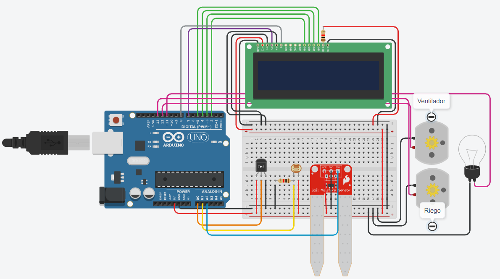

# Informe TP

**Alumnos**: Paz Moreno, Rodolfo Meroi.

---

# Problemática

Se pide realizar un sistema de riego automatizado en base a la temperatura, humedad y cantidad de luz que reciben las plantas.

Con los datos obtenidos a través de sensores podemos activar automáticamente los ventiladores, el riego o la iluminación de las plantas dependiendo que sea necesario según las condiciones presentadas a continuación:

- Cuando la temperatura sea mayor a 30°C se activará el sistema de ventilación.
- Cuando la humedad sea menor al 80% se activará el sistema de riego.
- Cuando se detecte menor intensidad de luz, se encenderá la iluminación.

# Resolución

Elegimos utilizar Arduino porque cuenta con un software y hardware fáciles de usar además de ser de código abierto y contar con versatilidad y compatibilidad con una variedad de sensores, por ende, es ideal para realizar proyectos como el sistema de riego automatizado.

Además, decidimos conectar al Arduino una protoboard para una mayor comodidad, lograr mejor disposición de los sensores y no requiere de soldar las piezas, por lo cual, facilita la prueba y error.

Para controlar la temperatura utilizamos un sensor **TMP36** conectado a uno de los puertos analógicos para controlar su voltaje. Este voltaje lo mapeamos en un rango de 0-5 para luego transformarlo a grados Celsius utilizando la siguiente formula:

```cpp
float temperatura = ((5 * valorLeido0 * 100) / 1024) - 50;
```

Si la temperatura obtenida es mayor o igual a 30 se encenderá el motor que simula el ventilador.

Para medir la humedad decidimos usar un **sensor de humedad del suelo** cuyo voltaje cambia a medida que el suelo se humedece. Conectamos el sensor a uno de los puertos analógicos para controlar su voltaje y lo mapeamos en un rango de 0-100.

Si la humedad es menor al 80% se enciende el motor que simula el riego.

Para detectar la luz elegimos una **********fotorresistencia**********, un sensor cuya resistencia varía según la cantidad de luz que detecte. Conectamos el sensor a otro puerto analógico y mapeamos su valor en un rango de 0-100.

Cuando la resistencia sea menor a 50 se encenderá la bombilla.

Por último, decidimos agregar una **pantalla lcd 16x2** para mostrarle al usuario los valores de temperatura y humedad.

# Circuito



# Código

```cpp
#include <LiquidCrystal.h>
LiquidCrystal lcd(7,8,2,3,4,5);

int tmp = 0;
int ventilador = 12;

int hmd = 2;
int riego = 13;

int lmd = 1;
int led = 11;

void setup()
{
  lcd.begin(16,2);
  
  pinMode(ventilador, OUTPUT);
  pinMode(riego, OUTPUT);
  pinMode(led, OUTPUT);
  
  Serial.begin(9600);
}

void loop()
{
  lcd.setCursor(0,0);
  
  // Temperatura
  float valorLeido0 = analogRead(tmp);
  int voltaje = map(valorLeido0, 20, 358, 0, 5);
  float temperatura = ((5 * valorLeido0 * 100) / 1024) - 50;
  lcd.print("TEMP: ");
  lcd.print(temperatura);
  
  if (temperatura >= 30) {
  	digitalWrite(ventilador, HIGH);
  } else {
  	digitalWrite(ventilador, LOW);
  }
  
  // Humedad
  int valorLeido1 = analogRead(hmd);
  int humedad = map(valorLeido1, 0, 876, 0, 100);
  lcd.setCursor(0,1);
  lcd.print("HUMEDAD: ");
  lcd.print(humedad);
  lcd.print("%");
  
  if (humedad < 80) {
  	digitalWrite(riego, HIGH);
  } else {
  	digitalWrite(riego, LOW);
  }
  
  // Luminosidad
  int valorLeido2 = analogRead(lmd);
  int luminosidad = map(valorLeido2, 6, 679, 0, 100);
  
  if (luminosidad < 50) {
  	digitalWrite(led, HIGH);
  } else {
  	digitalWrite(led, LOW);
  }
}
```
