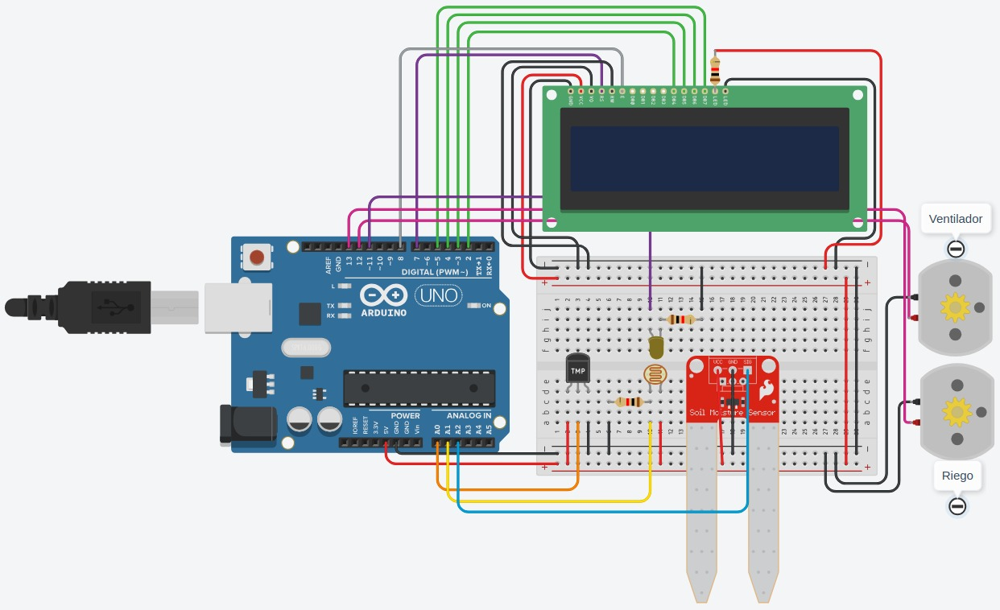
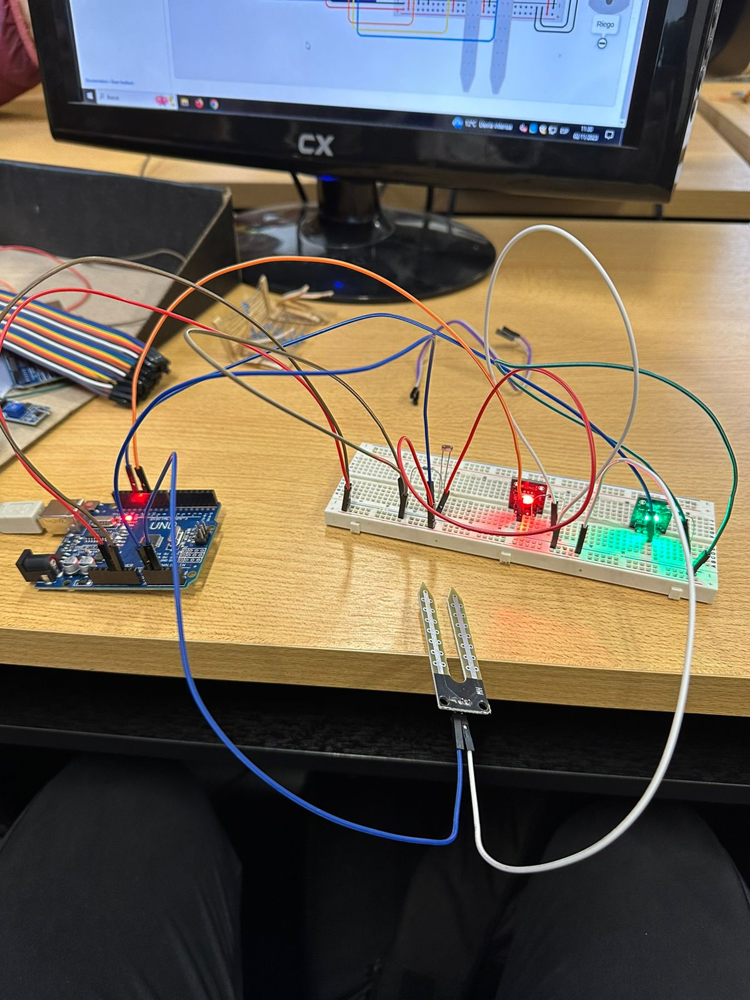
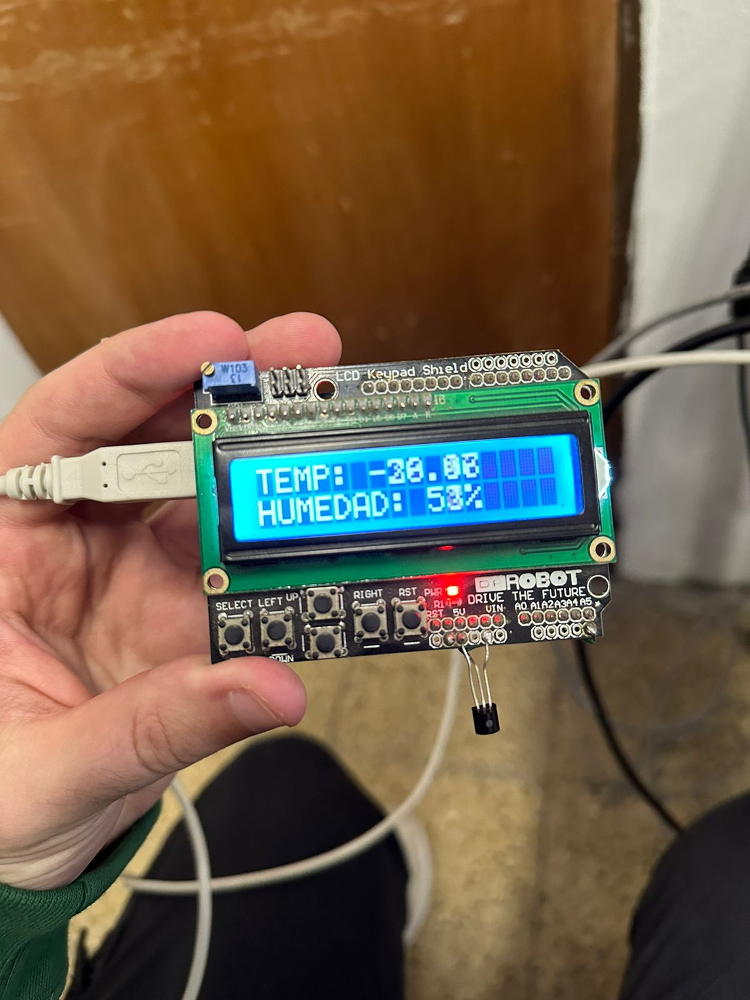

# Informe TP

**Alumnos**: Paz Moreno, Rodolfo Meroi.

# Problemática

Se pide realizar un sistema de riego automatizado en base a la temperatura, humedad y cantidad de luz que reciben las plantas.

Con los datos obtenidos a través de sensores podemos activar automáticamente los ventiladores, el riego o la iluminación de las plantas dependiendo que sea necesario según las condiciones presentadas a continuación:

- Cuando la temperatura sea mayor a 30°C se activará el sistema de ventilación.
- Cuando la humedad sea menor al 80% se activará el sistema de riego.
- Cuando se detecte menor intensidad de luz, se encenderá la iluminación.

# Resolución

Elegimos utilizar Arduino porque cuenta con un software y hardware fáciles de usar además de ser de código abierto y contar con versatilidad y compatibilidad con una variedad de sensores, por ende, es ideal para realizar proyectos como el sistema de riego automatizado.

Además, decidimos conectar al Arduino una protoboard para una mayor comodidad, lograr mejor disposición de los sensores y no requiere de soldar las piezas, por lo cual, facilita la prueba y error.

Para controlar la temperatura utilizamos un sensor **TMP36** conectado a uno de los puertos analógicos para controlar su voltaje. Este voltaje lo mapeamos en un rango de 0-5 para luego transformarlo a grados Celsius utilizando la siguiente formula:

```cpp
float temperatura = ((5 * valorLeido0 * 100) / 1024) - 50;
```

Si la temperatura obtenida es mayor o igual a 30 se encenderá el motor que simula el ventilador.

Para medir la humedad decidimos usar un **sensor de humedad del suelo** cuyo voltaje cambia a medida que el suelo se humedece. Conectamos el sensor a uno de los puertos analógicos para controlar su voltaje y lo mapeamos en un rango de 0-100.

Si la humedad es menor al 80% se enciende el motor que simula el riego.

Para detectar la luz elegimos una **fotorresistencia**, un sensor cuya resistencia varía según la cantidad de luz que detecte. Conectamos el sensor a otro puerto analógico y mapeamos su valor en un rango de 0-100.

Cuando la resistencia sea menor a 50 se encenderá el led.

Por último, decidimos agregar una **pantalla lcd 16x2** para mostrarle al usuario los valores de temperatura y humedad.

Una vez que terminamos de programar todo el código lo volcamos sobre el IDE de Arduino y lo cargamos a nuestra placa.
# Problemas encontrados

Uno de los problemas que tuvimos a la hora de armar el circuito en clase fue la elección de los leds, al principio utilizamos un led que parecía no funcionar pero que luego nos dimos cuenta de que era infrarrojo, por lo que decidimos cambiarlo a un led rgb.

Otro problema que tuvimos fue que a la hora de conectar la pantalla lcd vimos que la temperatura era negativa, esto era debido a que en tinkercad utilizamos el sensor TMP36 y en el armado del circuito físico utilizamos el sensor TMP35, ambos sensores manejan rangos de voltaje distinto, por lo que tuvimos que ajustarlo.
# Circuito



[Link Tinkercad](https://www.tinkercad.com/things/fY608tmlRse?sharecode=k268-rhFlE1D8nv-Bt2XuAGcgQ_irOZCZmJAFGdMfyQ)
# Circuito físico




