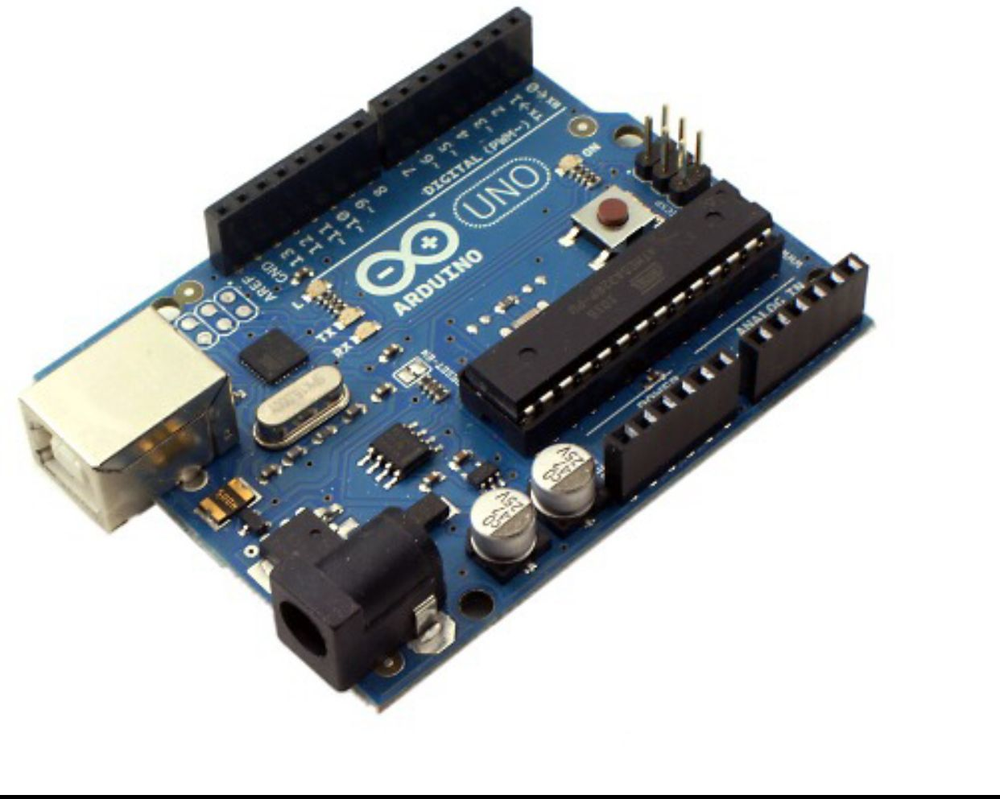
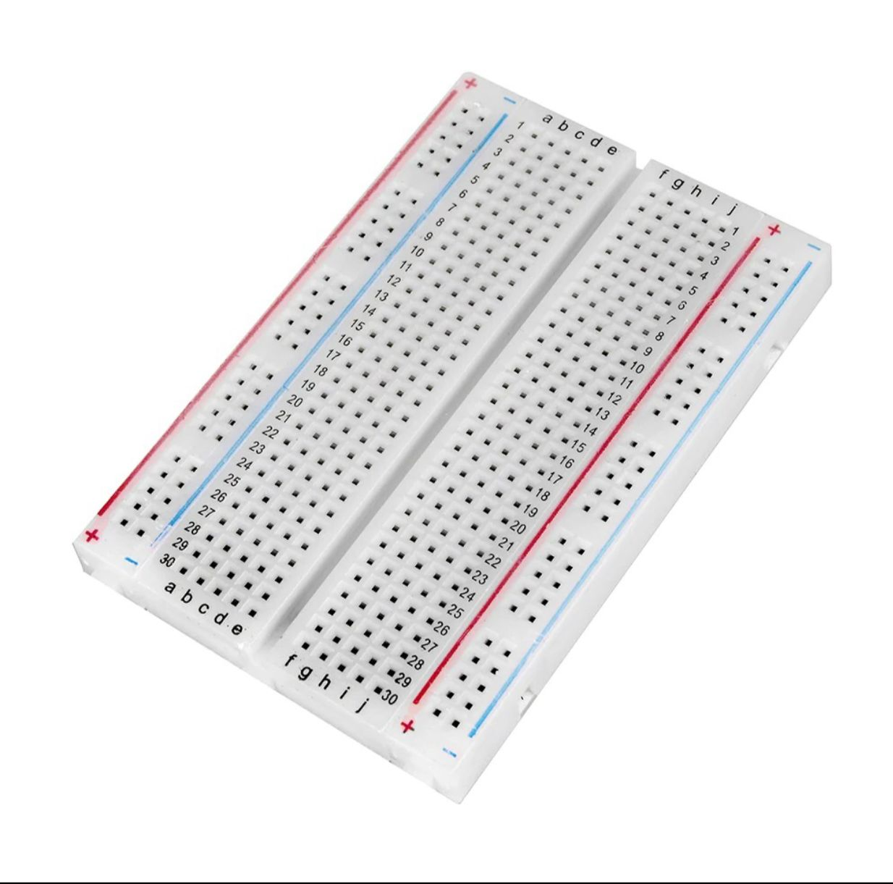
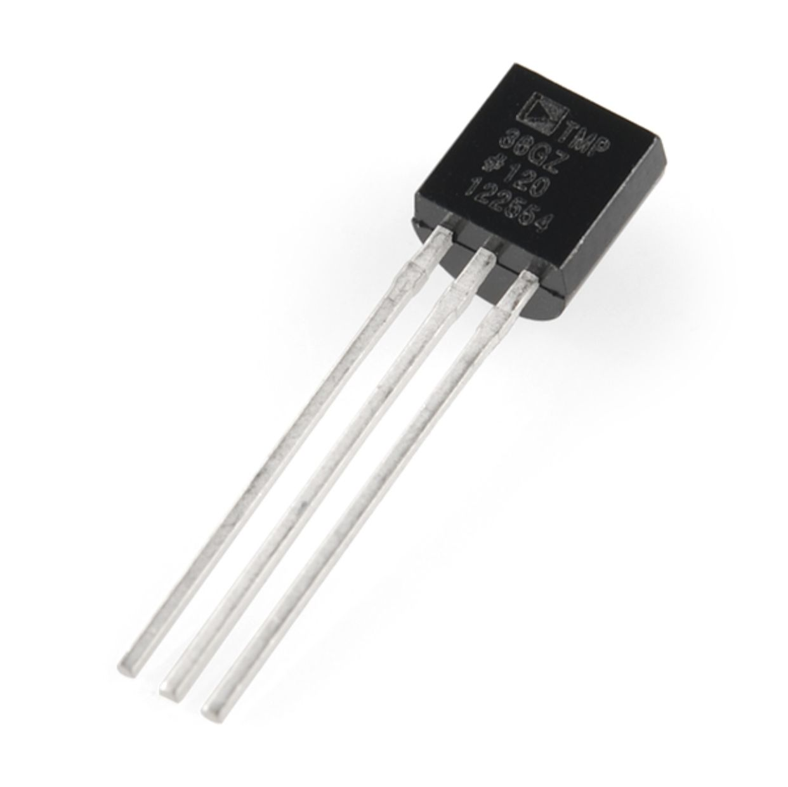
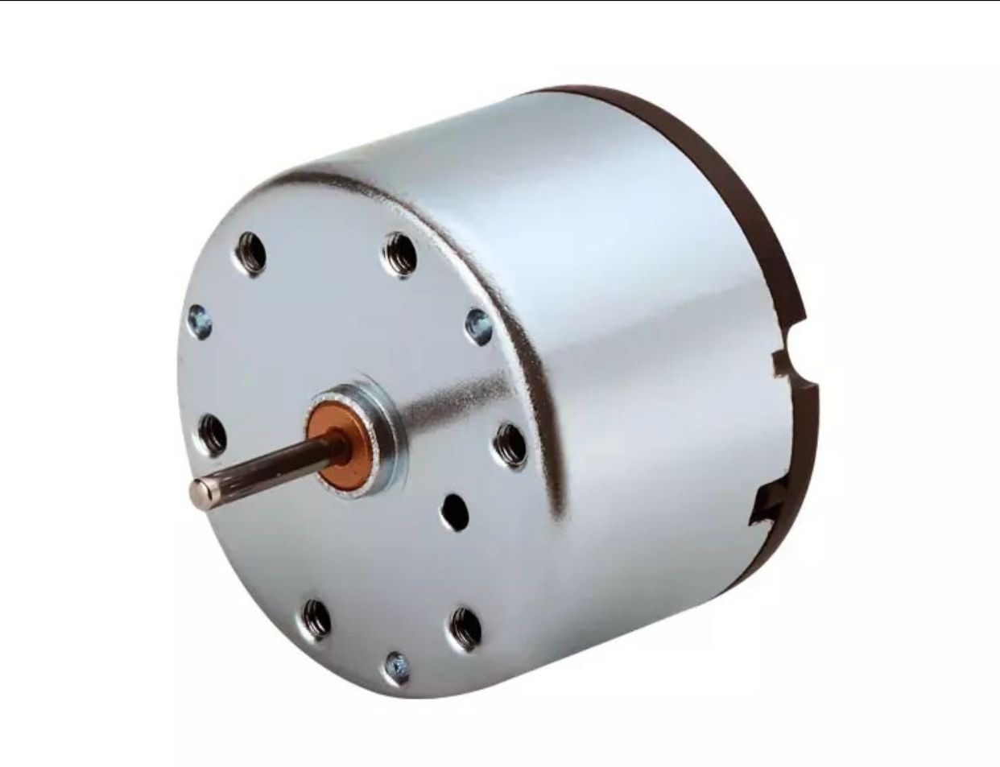
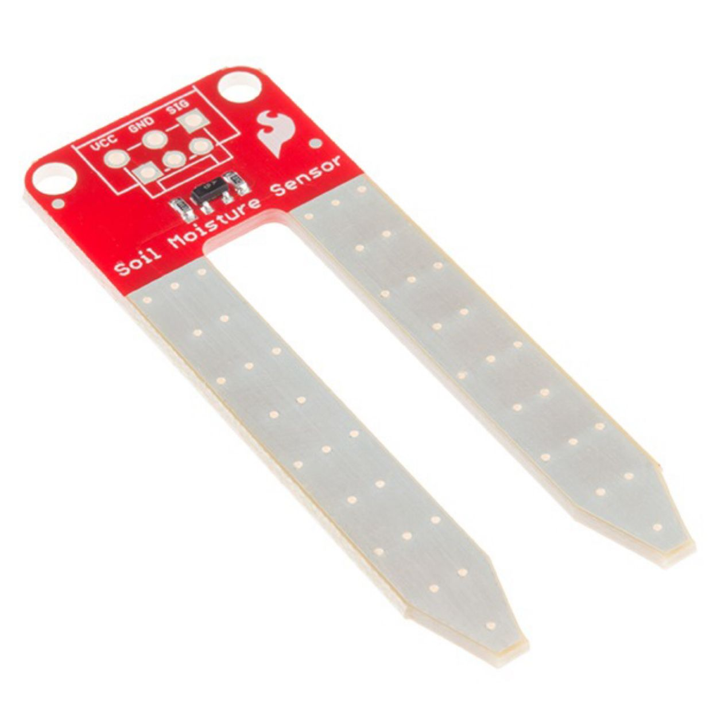
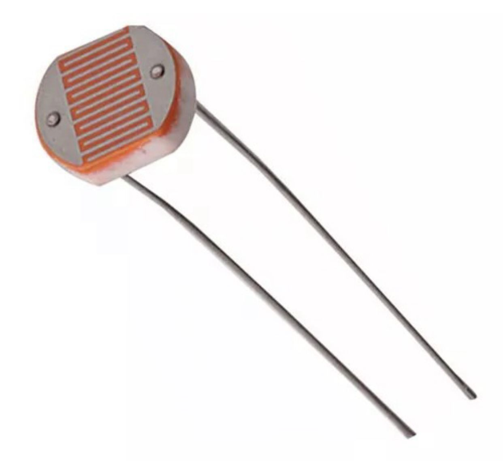
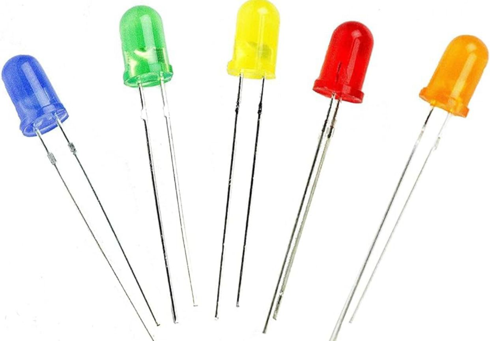
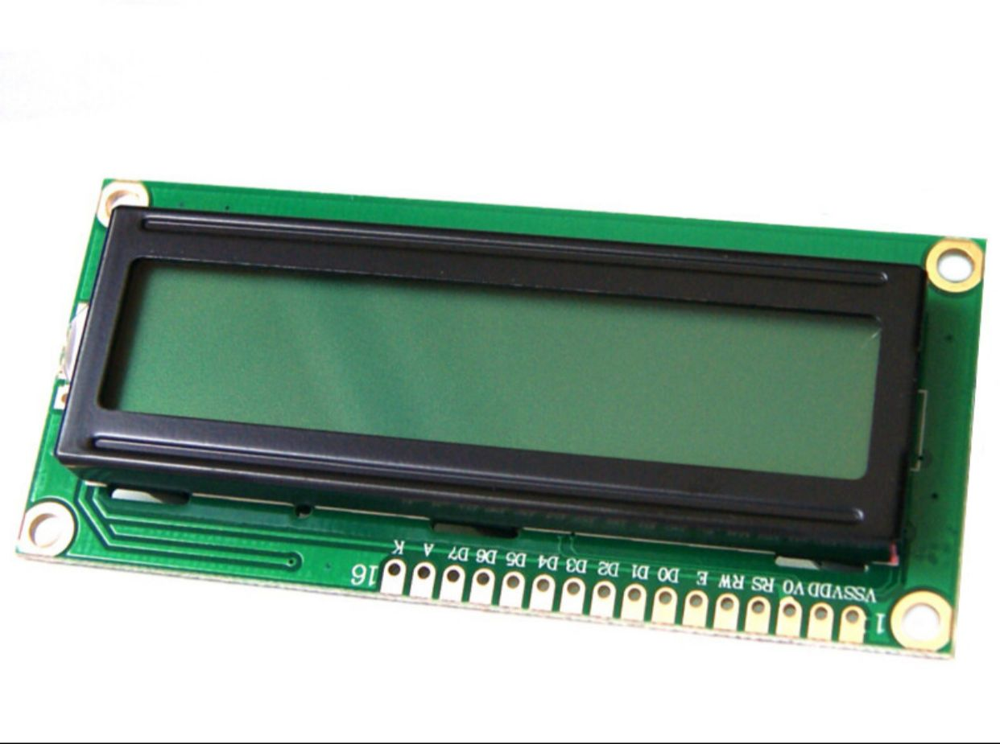

# Informe TP

**Alumnos**: Paz Moreno, Rodolfo Meroi.

# Problemática

Se pide realizar un sistema de riego automatizado en base a la temperatura, humedad y cantidad de luz que reciben las plantas.

Con los datos obtenidos a través de sensores podemos activar automáticamente los ventiladores, el riego o la iluminación de las plantas dependiendo que sea necesario según las condiciones presentadas a continuación:

- Cuando la temperatura sea mayor a 30°C se activará el sistema de ventilación.
- Cuando la humedad sea menor al 80% se activará el sistema de riego.
- Cuando se detecte menor intensidad de luz, se encenderá la iluminación.

# Resolución

Elegimos utilizar Arduino porque cuenta con un software y hardware fáciles de usar además de ser de código abierto y contar con versatilidad y compatibilidad con una variedad de sensores, por ende, es ideal para realizar proyectos como el sistema de riego automatizado.



Además, decidimos conectar al Arduino una protoboard para una mayor comodidad, lograr mejor disposición de los sensores y no requiere de soldar las piezas, por lo cual, facilita la prueba y error.



Para controlar la temperatura utilizamos un sensor **TMP36**, es utilizado para medir la temperatura ambiente. Convierte la temperatura en una señal eléctrica que puede ser interpretada por dispositivos electrónicos, como microcontroladores, facilitando el monitoreo térmico en diversos proyectos. Esta señal la mapeamos en un rango de 0-5 para luego transformarla a grados Celsius utilizando la siguiente formula:



```cpp
float temperatura = ((5 * valorLeido0 * 100) / 1024) - 50;
```

Si la temperatura obtenida es mayor o igual a 30 se encenderá el motor que simula el ventilador.

Para simular el ventilador utilizamos un motor de corriente continua (CC) se utiliza para convertir energía eléctrica en energía mecánica. Estos motores son comunes en una variedad de aplicaciones, desde juguetes eléctricos hasta sistemas industriales. Pueden controlarse fácilmente en velocidad y dirección, lo que los hace versátiles para diferentes aplicaciones.



Para medir la humedad decidimos usar un **sensor de humedad del suelo** mide la humedad del ambiente y proporciona esa información al microcontrolador. Al obtener lecturas de humedad del sensor, puedes tomar decisiones programáticas para ajustar condiciones o activar dispositivos en respuesta a cambios en el nivel de humedad del entorno. Conectamos el sensor a uno de los puertos analógicos para controlar su voltaje y lo mapeamos en un rango de 0-100.



Si la humedad es menor al 80% se enciende el motor que simula el riego.

Para detectar la luz elegimos una **fotorresistencia**, también conocida como LDR (resistor dependiente de la luz) cambia su resistencia eléctrica en respuesta a la intensidad de la luz que incide sobre ella. Este componente se utiliza en circuitos electrónicos para detectar la presencia o ausencia de luz ambiental. En aplicaciones prácticas, la fotoresistencia se emplea en sistemas como luces automáticas, termostatos sensibles a la luz, seguidores de luz solar y otros dispositivos que requieren respuesta a las condiciones de iluminación del entorno. Conectamos el sensor a otro puerto analógico y mapeamos su valor en un rango de 0-100.



Cuando la resistencia sea menor a 50 se encenderá el led. Un LED (diodo emisor de luz) se utiliza principalmente para emitir luz cuando una corriente eléctrica pasa a través de él en una dirección específica.



Por último, decidimos agregar una **pantalla lcd 16x2** (16 caracteres por 2 líneas) para mostrarle al usuario los valores de temperatura y humedad. Es comúnmente utilizada para mostrar información en proyectos electrónicos. Puede mostrar texto y algunos caracteres especiales, permitiendo la visualización de mensajes, datos o parámetros relevantes. En combinación con microcontroladores como Arduino, la pantalla LCD 16x2 se usa para proporcionar retroalimentación visual en tiempo real, como la temperatura medida, el estado de un sistema, mensajes de error, entre otras aplicaciones.



Una vez que terminamos de programar todo el código lo volcamos sobre el IDE de Arduino y lo cargamos a nuestra placa.
# Problemas encontrados

Uno de los problemas que tuvimos a la hora de armar el circuito en clase fue la elección de los leds, al principio utilizamos un led que parecía no funcionar pero que luego nos dimos cuenta de que era infrarrojo, por lo que decidimos cambiarlo a un led rgb.

Otro problema que tuvimos fue que a la hora de conectar la pantalla lcd vimos que la temperatura era negativa, esto era debido a que en tinkercad utilizamos el sensor TMP36 y en el armado del circuito físico utilizamos el sensor TMP35, ambos sensores manejan rangos de voltaje distinto, por lo que tuvimos que ajustarlo.
# Circuito


[Link Tinkercad](https://www.tinkercad.com/things/fY608tmlRse?sharecode=k268-rhFlE1D8nv-Bt2XuAGcgQ_irOZCZmJAFGdMfyQ)
# Circuito físico


# Conclusión

Este proyecto nos mostró el lado de la informática que nos permite programar, diseñar e implementar soluciones tecnológicas de manera práctica y simple. Tinkercad nos brindó la oportunidad de probar sin riesgo a comprometer los componentes, comprendiéndolos más a fondo y conociendo sus utilidades. Al finalizar el trabajo, obtener un vistazo de este mundo nos motiva a profundizar nuestros conocimientos y explorar nuevas posibilidades.
